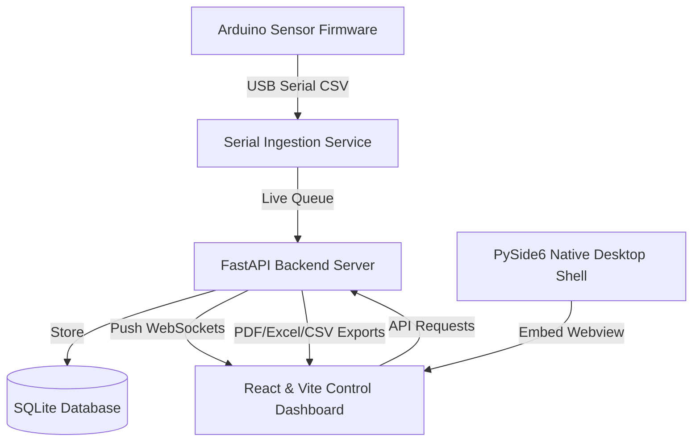

# Smart Windmill Energy Monitoring & Analytics Platform

A production-style monitoring and data analytics stack built for horizontal-axis windmill (HAW) prototypes. This platform ingests real-time serial sensor data, visualizes metrics, computes performance quality indicators, generates alerts, and exports historical data.

---

## 🏗️ System Architecture & Modules

The platform consists of four main modules:



### 1. FastAPI Backend (`backend/app/`)
* **Live Telemetry Ingestion**: Integrates with hardware ports via serial connections, parsing incoming CSV telemetry lines into Structured Pydantic schemas.
* **WebSocket Server**: Broadcasts telemetry data frames directly to connected clients at low latency (1Hz refresh).
* **Analytics Engine**: Computes running metrics (e.g., actual power output, power coefficient vs. the theoretical Betz limit, capacity factors, and voltage ripple/stability).
* **Alerting System**: Flags system faults such as over-voltage, turbine over-speed, or temperature alerts based on customizable thresholds.
* **Export Center**: Generates clean PDF reports (using ReportLab), Excel spreadsheets (openpyxl), and CSV archives.
* **Authentication**: Implements a secure SQLite session storage mapping token credentials.

### 2. React + Vite Control UI (`src/`)
* **Live Control Panel**: Houses interactive Recharts cards tracking RPM, power, windspeed, and voltage.
* **Specialized Analytics Modules**: Detailed panels for power efficiency and voltage ripple stability curves.
* **Serial Monitor Console**: Integrated terminal to review raw incoming serial data from the hardware connection.
* **System Settings**: Switch toggles for units (metric vs imperial), UI themes, and connection ports.

### 3. Arduino Firmware (`backend/firmware/`)
* Runs on the microcontroller prototype, scanning analog sensors.
* Transmits values via standard serial output in a comma-separated-value format at a 9600 baud rate.

### 4. Native Desktop Shell (`backend/desktop/`)
* Launches a native desktop app frame using PySide6 (Qt) embedding a Chromium WebEngineView.

---

## 📊 Telemetry Data Model

Data transmitted from the hardware over USB serial must match the following format:

```text
TIME,VOLTAGE,CURRENT,RPM,TEMP,WINDSPEED
12:01:02,5.32,0.45,320,31.2,4.8
```

* **TIME**: Ingest system timestamp or relative runtime.
* **VOLTAGE**: Measured generator voltage (Volts).
* **CURRENT**: Line current (Amperes).
* **RPM**: Windmill turbine speed (Revolutions Per Minute).
* **TEMP**: Internal temperature (Celsius).
* **WINDSPEED**: External wind velocity (m/s).

*Note: If no hardware device is connected, the backend automatically falls back to a simulated demo mode generating synthetic data matching physical aerodynamic behaviors.*

---

## 🔑 Default Credentials

The platform is secured by token authentication. Default operator accounts are initialized during database seeding:

| Role | Email | Password |
|---|---|---|
| **Administrator** | `admin@windmill.local` | `admin123` |
| **Operator** | `user@windmill.local` | `user123` |

---

## 🚀 Setup & Local Execution

### Prerequisites
* Python 3.10 or higher
* Node.js 18 or higher (with npm)

### 1. Backend Service Setup
Recreate the virtual environment and install the package dependencies:

```bash
# Initialize a local virtual environment
python3 -m venv .venv
source .venv/bin/activate

# Install the project and dependencies in editable mode
pip install -e .

# Run the FastAPI server
uvicorn backend.app.main:app --reload --host 127.0.0.1 --port 8000
```
The interactive API documentation will be available at `http://127.0.0.1:8000/docs`.

### 2. Frontend Dashboard Setup
In a new terminal window, build and run the development frontend server:

```bash
# Install NPM dependencies
npm install

# Start Vite server
npm run dev
```
Once started, the dashboard is accessible at `http://localhost:5173/`.

### 3. Native Desktop App Setup
If you want to wrap the interface in the PySide6 native desktop shell (make sure both backend and frontend are already running):

```bash
# Launch the Qt container wrapper
python backend/desktop/main.py
```

---

## 🌐 Production Build & GitHub Pages Deployment

To build the static frontend bundle and deploy it to GitHub Pages:

### 1. Configuration
The React application's Router and assets are configured to use a base path. In `vite.config.ts`, the base path property is set to match the repository name:
```typescript
export default defineConfig({
  base: '/haw/',
  // other configurations
})
```

### 2. GitHub Actions Deployment (Recommended)
This repository includes a continuous deployment workflow in `.github/workflows/deploy.yml`. When you push code changes to the `main` branch, the workflow will:
1. Spin up a secure Ubuntu runner environment.
2. Install Node.js dependencies.
3. Compile the Vite build (`npm run build`).
4. Package and host the static `/dist` directory to your GitHub Pages domain (`https://Jithun02.github.io/haw/`).

To configure this on GitHub:
1. Navigate to your repository settings on GitHub: **Settings** -> **Pages**.
2. Under **Build and deployment**, select **GitHub Actions** as the source.
3. Push your commits to `main`, and track build status under the **Actions** tab.